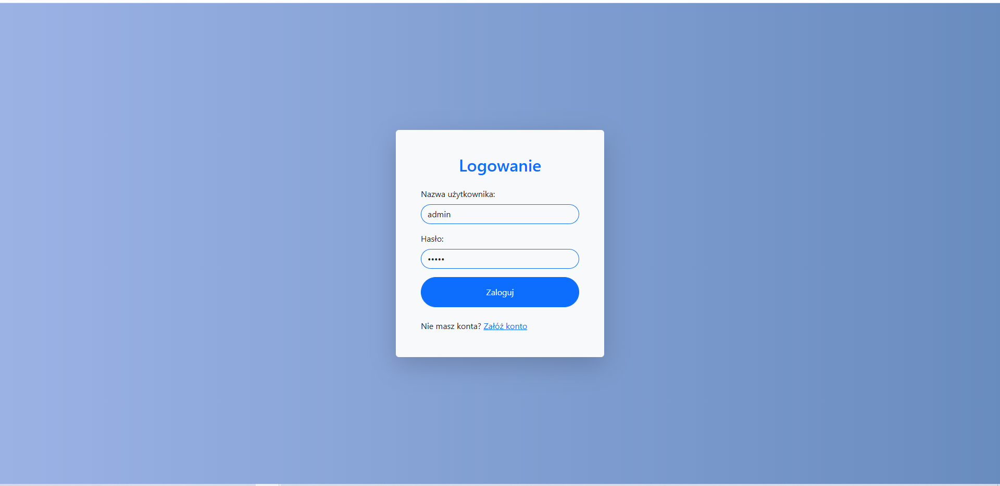
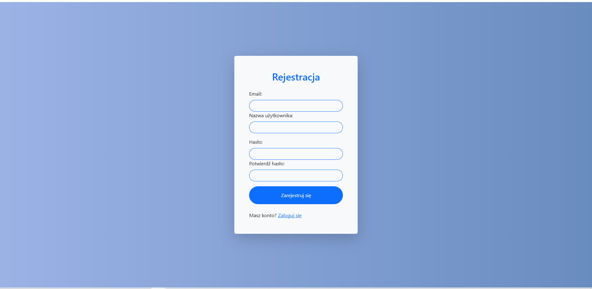
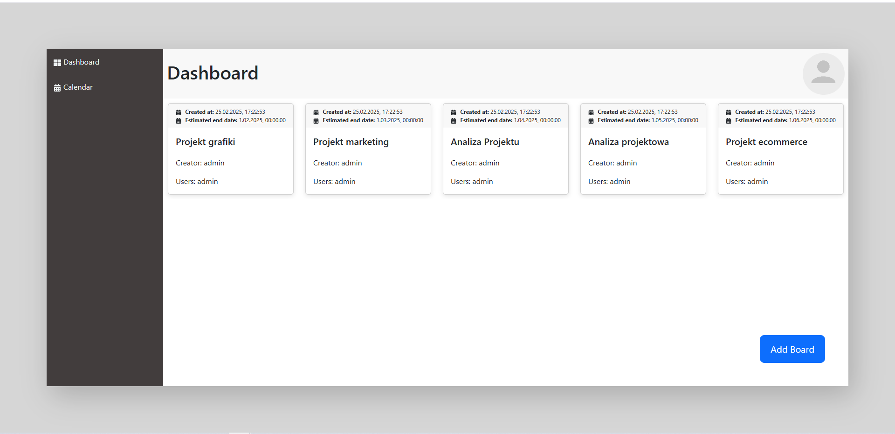
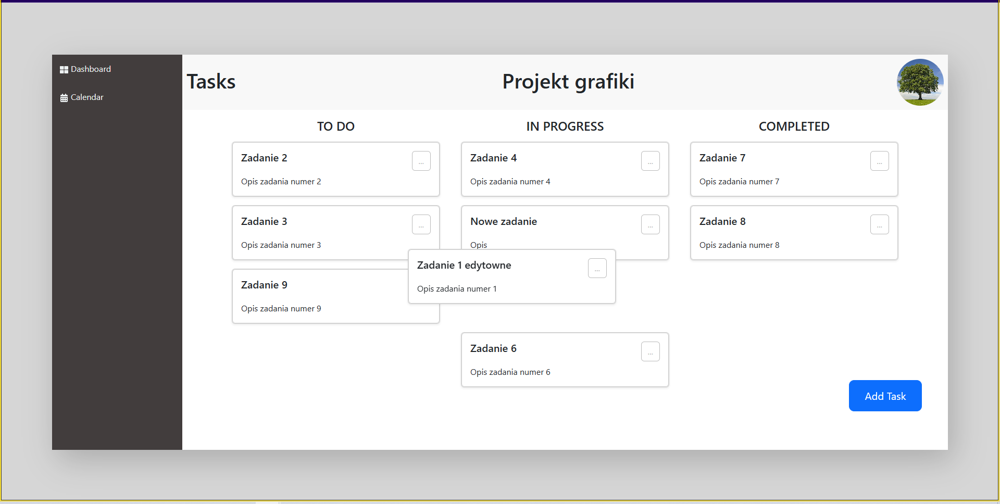
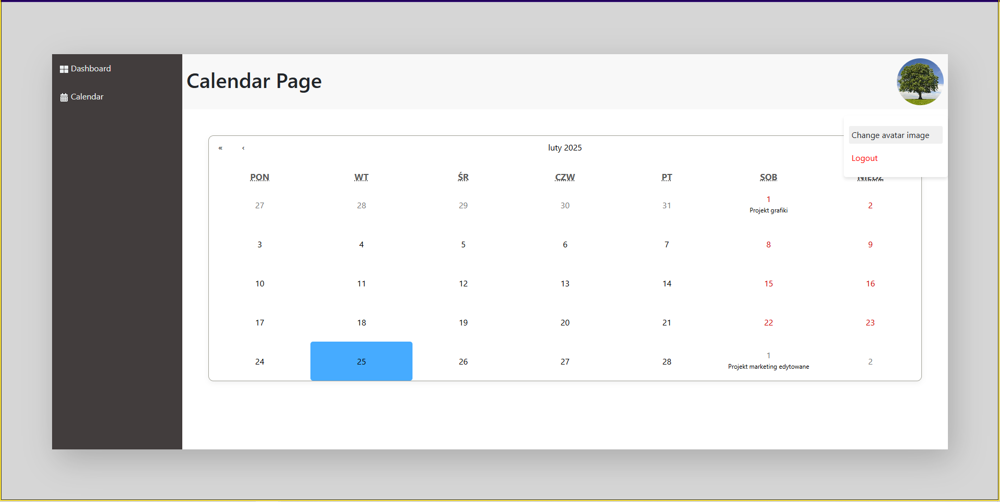

# TaskFlow

TaskFlow to aplikacja do zarządzania zadaniami, pozwalająca na tworzenie tablic (boards) z zadaniami, które można edytować, usuwać oraz przesuwać w interfejsie przy użyciu biblioteki **React Beautiful DnD**. Aplikacja oferuje również funkcje rejestracji, logowania, wylogowywania, dodawania avatara użytkownika oraz możliwość przypisywania innych użytkowników do tablic.

<div style="display: flex; justify-content: space-between;">
    
    
    
    
    
</div>

## Funkcjonalności

- **Rejestracja i logowanie** – użytkownicy mogą rejestrować się i logować do aplikacji.
- **Tworzenie tablic (boards)** – użytkownicy mogą tworzyć tablice do zarządzania zadaniami.
- **Edytowanie i usuwanie tablic** – użytkownicy mogą edytować i usuwać tylko swoje tablice.
- **Tworzenie zadań** – w obrębie tablic użytkownicy mogą dodawać zadania, które następnie mogą edytować i usuwać.
- **Edycja i usuwanie zadań** – użytkownicy mogą edytować lub usuwać zadania, ale tylko te, które sami dodali.
- **Przesuwanie zadań** – za pomocą **React Beautiful DnD** zadania można przeciągać między kolumnami.
- **Kalendarz** – za pomocą **React Calendar**, tablice z datami zakończenia są wyświetlane w kalendarzu.
- **Dodawanie avatara** – użytkownicy mogą dodać lub zmienić swoje zdjęcie profilowe.
- **Przypisywanie użytkowników do tablic** – użytkownicy mogą dodawać innych użytkowników do swoich tablic.
- **Wylogowanie** – użytkownicy mogą się wylogować z aplikacji.

## Technologie

- **Frontend**: React, Redux Toolkit, React Beautiful DnD, React Bootstrap
- **Backend**: Spring Boot
- **Baza danych**: H2 Database

## Instalacja

1. **Klonowanie repozytorium**
   Aby sklonować repozytorium, użyj polecenia:
   ```bash
   git clone https://github.com/kamilb13/task_flow-app-frontend.git
   
- Dla backendu:
   ```bash
   git clone https://github.com/kamilb13/task_flow-app-backend.git

2. **Instalacja zależności**
Przejdź do katalogów frontend i backend, a następnie zainstaluj wymagane zależności.

3. **Frontend (React):**
   ```bash
    cd task_flow_app_frontend
    npm install
   
4. **Backend (Spring Boot):**
   ```bash
    cd task_flow_app_backend
    ./mvnw install

5. **Konfiguracja bazy danych**
Baza danych H2 jest wbudowana, ale można ją skonfigurować, edytując ustawienia w plikach konfiguracyjnych Spring Boot.

6. **Uruchomienie aplikacji**

- Frontend:
   ```bash
    cd task_flow_app_frontend
    npm start

- Backend:
   ```bash
    cd task_flow_app_backend
    ./mvnw spring-boot:run

Aplikacja będzie dostępna pod adresem http://localhost:3000 dla frontendu i http://localhost:8080 dla backendu (lub zgodnie z ustawieniami).

7. **Licencja** MIT
